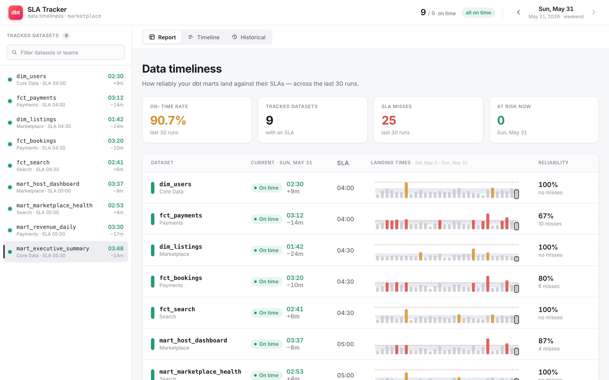
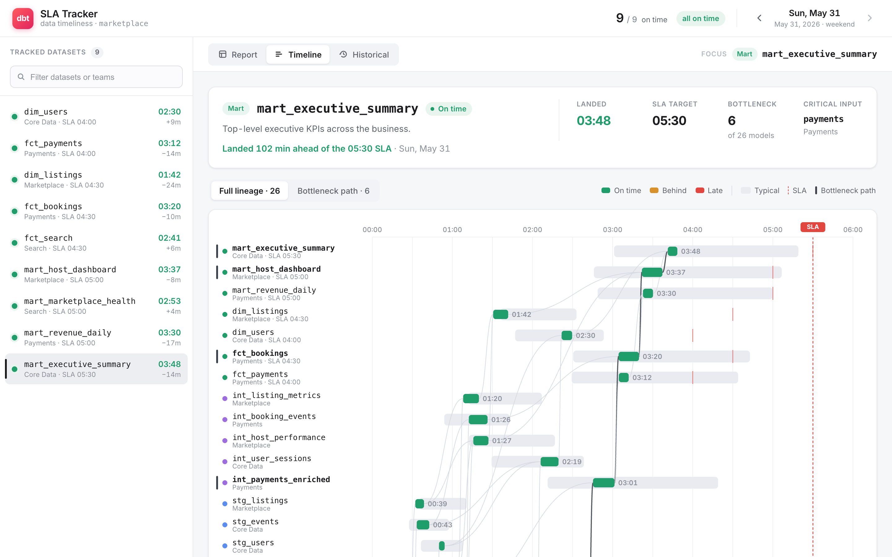
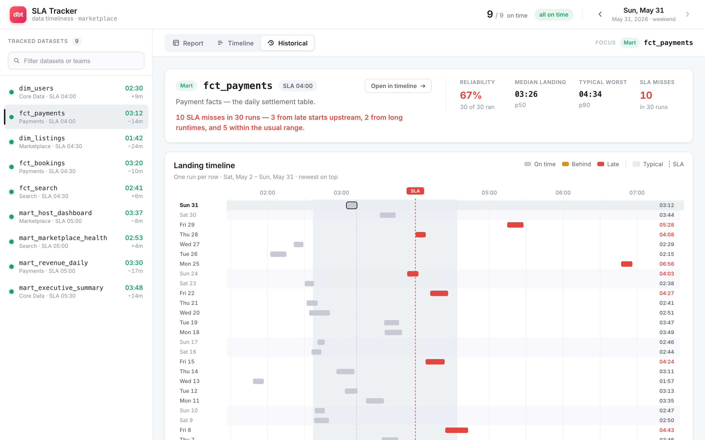
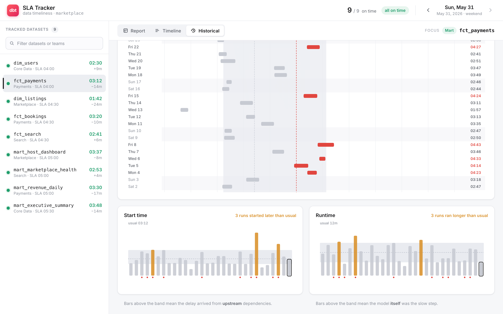

# dbt SLA Tracker

**Data-timeliness visualization for a dbt project.** It answers three questions a data team actually asks every morning: *did my important tables land on time? if not, what held them up? and is this a one-off or a pattern?*

Think of it as an SLA dashboard that understands the dbt DAG — not just "this table was late," but *which upstream model* made it late, and whether the delay came from **starting late** (an upstream/dependency problem) or **running long** (the model itself).



> Heads up: out of the box it runs on a built-in **synthetic** dbt project (a realistic 8-source, 25-model marketplace with 30 days of simulated runs), so the screenshots here are synthetic — not a real warehouse. To point it at your own project, see [Use it on your own dbt project](#use-it-on-your-own-dbt-project) — or just [run it with Docker](#run-it-with-docker) and mount your artifacts.

---

## The gist

Three views, one shared idea: a table's "landing time" is `start + runtime`, so when it's late, the blame splits cleanly between *when it could start* (your dependencies) and *how long it took to build* (you).

- **Report** — the front door. Every dataset that carries an SLA, its current landing time vs. target, and a 30-day sparkbar so you can spot the misses (red) at a glance.
- **Timeline** — a dependency-inclusive Gantt of a single dataset's full lineage for one run, with the **bottleneck path** highlighted: the exact chain of upstream models that gated the landing.
- **Historical** — 30 runs of one dataset stacked up, plus the key decomposition: of all the SLA misses, how many were **late starts** (upstream) vs. **long runtimes** (the model itself).

---

## Why this exists

It's a dbt-flavored take on Airbnb's [*Visualizing Data Timeliness*](https://medium.com/airbnb-engineering/visualizing-data-timeliness-at-airbnb-ee638fdf4710) (their SLA Tracker). That post makes a point that's easy to nod along to and surprisingly hard to act on: a single "landed at 05:58, SLA was 05:30" number tells you *that* you're late but nothing about *why*. And "why" is the only part that tells you what to fix.

For dbt specifically that gap stings, because everything is a graph. Your `mart_executive_summary` is late, sure — but it sits on top of 25 other models. Was it your model's SQL that got slow? Or did the `payments` source show up two hours late and cascade all the way down? Those are completely different problems with completely different owners, and a flat SLA report can't tell them apart.

So this tool leans into the dbt structure:

- It knows the **DAG**, so it can walk a late table back to the specific upstream node that kept it waiting (the bottleneck path).
- It separates **start time** from **runtime** for every run, so "you started late" and "you ran long" are different colors of bar, not the same red.
- It uses **30 days of history** to learn what "normal" looks like per model (p10/p50/p90 bands), so "behind" means *behind for this model* — not behind some global threshold.

The result is meant to feel less like a status page and more like a diagnosis.

---

## The three views

### Report

The overview up top (first screenshot). One row per tracked dataset: current landing time, the SLA target, a 30-day strip of landing bars (red = missed SLA, amber = slower than usual, gray = fine; today's run is outlined), and a reliability % on the right. Summary stats across the top — on-time rate, dataset count, total misses, anything at risk right now.

### Timeline



Pick a dataset and you get its entire lineage laid out on a time axis for the selected run — sources arriving, then staging → intermediate → marts building as their parents land. The dashed red line is the SLA. The **bottleneck path** is drawn bold: walking back from the target, at each hop we pick the parent that *finished last* (the one that actually gated the next step). For a 26-model lineage that collapses the whole haystack down to the ~6 models that decided when the table could land. The summary calls out the critical input (here: `payments`) and how the run did against SLA.

Toggle between **Full lineage** and just the **Bottleneck path** when the graph gets busy.

### Historical



One dataset, 30 runs, newest on top — a "small multiples" strip where each row is a run and the bar sits at its landing time. Misses land to the right of the red SLA line and turn red. The shaded band is the *typical* landing window, so you can see at a glance whether a given day was normal or an outlier.

Then the part that's the whole point — the breakdown:



Two small-multiple charts, **Start time** and **Runtime**, each with that model's typical band. A bar poking *above* the band on the left means the run started later than usual → the delay came from **upstream**. A bar above the band on the right means the build itself ran long → the model was **the slow step**. The headline sentence does the accounting for you, e.g.:

> *10 SLA misses in 30 runs — 3 from late starts upstream, 2 from long runtimes, and 5 within the usual range.*

That last bucket ("within the usual range") is deliberate — it's honest about misses where *nothing* was anomalous and the SLA is just tight, instead of forcing a false cause.

---

## Setup & run

You need **Node 18+** (Node 20 is comfy) and npm.

```bash
# from the repo root
npm install        # install deps
npm run dev        # start Vite on http://localhost:5173
```

That's it — open the URL & you're looking at the synthetic project.

Other scripts:

```bash
npm run build      # type-check (tsc -b) + production build to dist/
npm run preview    # serve the built dist/ locally
```

No env vars, no API keys, no database — it's a static front-end running entirely on the bundled sample data.

> Don't want to install Node at all? Jump to [Run it with Docker](#run-it-with-docker) — one container, nothing else.

---

## Use it on your own dbt project

Three steps, no code: **collect your dbt artifacts**, **write a small `config.yml`**, **run the container**.

### 1. Collect a run's artifacts after each build

Every `dbt build` writes `target/manifest.json` (the DAG) and `target/run_results.json` (per-model timing + status). `dbt source freshness` adds `target/sources.json` (when each source landed). The tool wants **one snapshot per run**, so in your orchestrator (Airflow / Dagster / cron), right after the build, copy `target/` into a dated folder:

```bash
# after:  dbt build   (and optionally:  dbt source freshness)
DEST="history/$(date -u +%F)"
mkdir -p "$DEST"
cp target/manifest.json target/run_results.json "$DEST"/
cp target/sources.json "$DEST"/ 2>/dev/null || true   # if you run freshness
```

Do that daily and you build up the history the Report & Historical views want — **~30 days is the sweet spot** (that's the window the typical p10/p50/p90 bands are learned over). You'll end up with one folder per run:

```
my-project/
  history/
    2026-05-30/   manifest.json  run_results.json  sources.json
    2026-05-31/   manifest.json  run_results.json  sources.json
    …
```

(That's a plain snapshot of `target/` per run, named by date. A flat `manifest.json` + `runs/run_results.<date>.json` layout works too — both are auto-detected.)

### 2. Write a `config.yml`

One small file tells the tool where your artifacts are and which datasets have SLAs — no code, and no editing your dbt project. Drop it next to `history/`:

```yaml
# my-project/config.yml
artifacts: ./history

# Which datasets have a landing-time SLA, and what it is ("HH:MM" UTC):
slas:
  mart_revenue_daily: "05:00"
  mart_executive_summary: "05:30"
  fct_payments: "04:00"
```

That's the whole required config — the [Configuration](#configuration) section lists every option. (Prefer to keep SLAs in your dbt project? You can — set `meta.sla` on the model and drop the `slas:` block. The config file is just the no-dbt-edit path.)

### 3. Run it

Point the container at the folder holding your `config.yml` + `history/`:

```bash
docker run --rm -p 8080:8080 -v "$PWD/my-project:/data:ro" dbt-sla-tracker
#  → http://localhost:8080
```

On startup the server reads your config, runs the adapter over your snapshots, and serves the app rendering *your* models, lineage, and SLA history — nothing to install, no build step. Captured a new day? Hit the **Refresh** button in the header and it shows up — no restart. (No artifacts at all → you get the synthetic demo.)

---

## Configuration

Everything the tool needs comes from one YAML file. The server looks for it at `$CONFIG_FILE`, then `/config/config.yml`, then `<your data dir>/config.yml` — so the simplest setup is a `config.yml` sitting next to your artifacts. There's a complete, commented template in [`config.example.yml`](config.example.yml). Every key is optional; with no config at all it serves the demo.

| Key | Default | What it does |
|---|---|---|
| `artifacts` | — (demo) | Path to your dated dbt artifacts (folder-per-run snapshots of `target/`, or a flat `manifest.json` + `runs/`). Relative paths resolve from the config file. |
| `slas` | from dbt `meta.sla` | Declare SLAs without touching your dbt project. Map of model name (or `unique_id`) → `"HH:MM"` UTC. Adds to / overrides `meta.sla`. |
| `owners` | from dbt `meta.owner` | Owner-label overrides, same keying. |
| `project_name` | manifest's name | Display name in the header. |
| `max_runs` | all found | Load only the N most-recent runs. |
| `port` | `8080` | Port the server listens on (env `PORT` wins). |

```yaml
# config.yml
artifacts: ./history
project_name: Marketplace Analytics
max_runs: 30

slas:
  mart_revenue_daily: "05:00"
  fct_payments: "04:00"

owners:
  mart_revenue_daily: Data Platform
```

SLA / owner keys can be a short model name (`mart_revenue_daily`) or a full dbt `unique_id` (`model.my_project.mart_revenue_daily`) — the short name is matched for you. A malformed time like `"9:99"` is skipped with a warning rather than silently applied.

---

## Run it with Docker

No Node, no `npm install` — build the image once, then run it anywhere.

```bash
docker build -t dbt-sla-tracker .

# your project (a folder with config.yml + your artifacts, see above):
docker run --rm -p 8080:8080 -v "$PWD/my-project:/data:ro" dbt-sla-tracker

# or just the synthetic demo (no volume):
docker run --rm -p 8080:8080 dbt-sla-tracker
```

Then open <http://localhost:8080>. Or with Compose (edit the volume path in `docker-compose.yml` to your artifacts):

```bash
docker compose up --build
```

How it's wired, since it's deliberately boring:

- **Multi-stage build.** Stage one runs `npm ci && npm run build` (the SPA) and bundles the server; the runtime stage is just `node:20-alpine` + the static `dist/` + a single self-contained `server.mjs`. No `node_modules` in the final image.
- **One small server** (`scripts/cli/server.mjs`). It serves the SPA and, at startup, reads your config + `/data`, runs the **same** `loadProject()` adapter the app is built around, and injects the resulting project into the page as `window.__DBT_PROJECT__` — so the first paint already holds your data, no API call. The header's **Refresh** button then re-fetches `/project.json`, which the server rebuilds from disk on each hit, so newly-landed runs appear without a restart.
- **Config:** a `config.yml` (see [Configuration](#configuration)), plus the env knobs `PORT`, `DATA_DIR`, and `CONFIG_FILE`. `GET /healthz` is there for orchestrators, and `GET /project.json` returns the resolved project if you want to eyeball what it parsed.

Same thing runs outside Docker after a build, if you'd rather:

```bash
npm run build && npm run build:server
CONFIG_FILE=./config.yml npm start   # or just `npm start` for the demo
```

---

## Advanced: customizing the code

You don't need any of this to use the tool — `config.yml` covers the common cases. This section is for **changing how it works**: writing your own data loader, pulling from the dbt Cloud API, or baking data in at build time. Under the hood every view consumes a single plain object — a `DbtProject` — and doesn't care where it came from, so it's all just about how that object gets built.

### The short version

1. Parse your artifacts and call `loadProject(manifest, history)` (it lives in `src/data/loadProject.ts`) — you get a `DbtProject` back.
2. Hand that project to the app. The container does this for you; for a build-time bake instead, point `src/data/source.ts` at it.

Everything else — the typical bands, the status logic, all three views — is pure and runs on whatever `DbtProject` you produce. The adapter's already written & tested; you just supply the files.

### Where the data comes from

dbt already emits everything you need; it's in `target/` after every invocation. The types were modeled directly against these files:

| You need… | dbt gives you… | Maps to |
|---|---|---|
| The DAG (models, layers, dependencies) | **`manifest.json`** → `nodes` + `sources` (each has `unique_id`, `name`, `config.materialized`, `schema`, `tags`, `description`, `depends_on.nodes`, `config.meta`) | `DbtModel[]`, `childrenOf` |
| Per-run execution timing & status | **`run_results.json`** → `results[]` (each has `unique_id`, `status`, `execution_time`, and a `timing[]` array with the `execute` phase's `started_at` / `completed_at`, plus `adapter_response.rows_affected`) | `ProjectRun` → `ModelRun` |
| Source freshness (optional) | **`sources.json`** from `dbt source freshness` (`max_loaded_at`, `snapshotted_at`, `status`) | source arrival times on the timeline |

The one thing dbt **doesn't** model natively is an **SLA**, so you declare it yourself in a model's `meta`:

```yaml
# models/marts/_marts.yml
models:
  - name: mart_revenue_daily
    config:
      meta:
        sla: "05:00"          # target landing, batch-local time
        owner: "Data Platform" # optional, shown in the UI
```

…and the adapter reads `node.config.meta.sla` → `Sla.targetMinutes`.

The key idea to keep straight: every time in the app is **"minutes after the run's reference midnight."** Each `ProjectRun.date` is 00:00 of that run's logical day; landing/start are offsets from it. So pick a reference timezone (the app *formats* in UTC) and anchor consistently.

### Getting 30 days of history

One `run_results.json` only describes the *latest* invocation. To get the 30-day history the Historical & Report views want, you persist each daily run's artifacts and load them as a series. In practice that's a one-liner in your orchestrator — after `dbt build`, upload `target/manifest.json` + `target/run_results.json` to S3/GCS keyed by date. The adapter then reads the last N and sorts them into `runs[]` (chronological, newest last).

### Where the app gets its data (the seam)

`src/data/source.ts` is the single place the app decides where its `DbtProject` comes from:

```ts
// src/data/source.ts
export const project = injectedProject() ?? syntheticProject;
//                     ^ container-injected data   ^ bundled synthetic demo
```

To **bake dbt artifacts into the build** at compile time instead (no server, fully static output), swap the fallback for the fixtures loader:

```ts
import { loadProjectFromFixtures } from "./loadProject";
export const project = injectedProject() ?? loadProjectFromFixtures();
```

`loadProjectFromFixtures()` is a thin Vite wrapper that globs `fixtures/dbt/` and calls `loadProject(manifest, history)` — drop your own dated artifacts in there and they get bundled straight into `dist/`. (The container path needs none of this; it calls `loadProject()` server-side and injects the result.)

### The adapter

It's a real module now — `src/data/loadProject.ts` — and the shape of it is exactly this mechanical mapping. The snippet below is lightly simplified; the actual file also folds in `sources.json` for source arrival times, handles skipped/errored nodes that have no `execute` timing (falls back to the run's midnight), and aliases dbt's `pass`/`fail` statuses:

```ts
// src/data/loadProject.ts
import type {
  DbtProject, DbtModel, ProjectRun, ModelRun, Sla, ModelLayer,
} from "@/types/dbt";

// You supply these: parsed JSON for each day's run.
type Manifest = { nodes: Record<string, any>; sources: Record<string, any> };
type RunResults = { metadata: { generated_at: string }; results: any[] };

const layerOf = (node: any): ModelLayer =>
  node.resource_type === "source" ? "source"
  : /(^|\.)stg_|\/staging\//.test(node.fqn?.join(".") ?? node.path) ? "staging"
  : /(^|\.)int_|\/intermediate\//.test(node.fqn?.join(".") ?? node.path) ? "intermediate"
  : "marts";

const hhmmToMinutes = (s: string) => {
  const [h, m] = s.split(":").map(Number);
  return h * 60 + m;
};

export function loadProject(
  manifest: Manifest,
  history: RunResults[],          // one per day, oldest → newest
): DbtProject {
  const nodes = { ...manifest.sources, ...manifest.nodes };

  const models: DbtModel[] = Object.values(nodes)
    .filter((n: any) => n.resource_type === "model" || n.resource_type === "source")
    .map((n: any) => ({
      uniqueId: n.unique_id,
      name: n.name,
      layer: layerOf(n),
      materialization: n.config?.materialized ?? "source",
      schema: n.schema,
      owner: n.config?.meta?.owner ?? n.group ?? "—",
      tags: n.tags ?? [],
      description: n.description ?? "",
      dependsOn: n.depends_on?.nodes ?? [],
    }));

  const slas: Record<string, Sla> = {};
  for (const n of Object.values<any>(nodes)) {
    const sla = n.config?.meta?.sla;
    if (sla) {
      slas[n.unique_id] = {
        uniqueId: n.unique_id,
        targetMinutes: hhmmToMinutes(sla),
        label: `${sla} UTC`,
      };
    }
  }

  const runs: ProjectRun[] = history.map((rr) => {
    const day = new Date(rr.metadata.generated_at);
    const date = Date.UTC(day.getUTCFullYear(), day.getUTCMonth(), day.getUTCDate());
    const results: Record<string, ModelRun> = {};
    for (const r of rr.results) {
      const exec = r.timing?.find((t: any) => t.name === "execute");
      results[r.unique_id] = {
        uniqueId: r.unique_id,
        status: r.status === "success" || r.status === "pass" ? "success"
              : r.status === "skipped" ? "skipped" : "error",
        startedAt: exec ? Date.parse(exec.started_at) : date,
        completedAt: exec ? Date.parse(exec.completed_at) : date,
        executionSeconds: r.execution_time ?? 0,
        rowsAffected: r.adapter_response?.rows_affected ?? null,
      };
    }
    return { runId: rr.metadata.generated_at, date, startedAt: date, results };
  });

  // index helpers (modelsById, childrenOf) — same as generate.ts
  const modelsById = Object.fromEntries(models.map((m) => [m.uniqueId, m]));
  const childrenOf: Record<string, string[]> = {};
  for (const m of models) childrenOf[m.uniqueId] = [];
  for (const m of models) for (const p of m.dependsOn) childrenOf[p]?.push(m.uniqueId);

  return { name: "your_project", models, modelsById, childrenOf, slas, runs };
}
```

### Try it on the sample artifacts

I didn't want to hand-wave this, so the repo ships a folder of synthetic dbt artifacts the adapter actually reads:

```
fixtures/dbt/
  manifest.json                    # the DAG: 25 models + 8 sources
  runs/
    run_results.2026-05-02.json    # one per day…
    sources.2026-05-02.json        # …+ that day's source freshness
    …                              # (30 days)
```

These aren't hand-authored — `npm run fixtures` serializes the synthetic project straight out into real dbt artifact shapes. Which sets up a clean round-trip test: generate → write artifacts → `loadProject` reads them back → assert it reconstructs the same project, down to every run's status, row counts, & timing. That's what `npm run fixtures:verify` checks, and it's the closest thing to a real integration test I can run without a warehouse.

```bash
npm run fixtures          # regenerate fixtures/dbt/ from the synthetic project
npm run fixtures:verify   # round-trip: artifacts -> loadProject -> deep-equals the original
```

To actually *see* the app run on adapter-loaded data, either mount `fixtures/dbt` into the container (`-v "$PWD/fixtures/dbt:/data:ro"`) or do the one-line swap in `src/data/source.ts`. Because the round-trip is faithful, it renders identically to the default — same numbers, just sourced through the adapter instead of the generator.

### On dbt Cloud? Skip the files.

If you're on dbt Cloud, you don't have to wrangle artifacts at all — the **Discovery API** (GraphQL) exposes per-run, per-model `executionTime`, `executeStartedAt`, `executeCompletedAt`, `status`, plus the graph & `meta`. Query the last N job runs and map them into `ProjectRun[]` the same way. Same target shape, nicer transport.

---

## How it works under the hood

The interesting logic is small & lives in `src/lib/`:

- **`stats.ts` — what's "typical."** For each model it takes the last 30 successful runs and computes p10/p50/p90 bands for *landing time*, *start time*, and *duration*. That's what every "vs. usual" overlay and band is drawn from.
- **`status.ts` — grading one run.** `late` if it missed its SLA; `behind` if it landed past its own p90 (+ a few min of slack) but still made SLA; `on_time` otherwise; plus `error` / `skipped` straight from the run status. So "behind" is always relative to *that model's* normal, not a global number.
- **`bottleneck.ts` — the critical path.** Walk from the target back through `dependsOn`, at each hop choosing the parent with the latest `completedAt` (the one that kept this node waiting). Ordered target-first, ending at a source. This is what the Timeline draws bold.
- **`lineage.ts` — DAG traversal.** ancestors/descendants, topo-sort, longest-path depth, and in-set edges — the plumbing the Gantt uses to lay out & connect nodes.
- **`time.ts` — the time model.** Everything internal is "minutes after the run's midnight"; all formatting is UTC so the early-morning batch window reads consistently regardless of who's looking.

The decomposition that powers the Historical view falls right out of this: a run is a **late start** when its `start` exceeds the typical `start.p90`, and a **long runtime** when its `duration` exceeds the typical `duration.p90`. A miss can be one, both, or neither.

---

## Project layout

```
src/
  types/dbt.ts            # the domain model (DbtProject, DbtModel, ProjectRun, …)
  data/
    generate.ts           # the synthetic project (the demo default)
    loadProject.ts        # adapter: real dbt artifacts -> DbtProject
    source.ts             # picks the data source (injected real data / synthetic)
  lib/
    stats.ts              # typical p10/p50/p90 bands
    status.ts             # on_time / behind / late / error / skipped
    bottleneck.ts         # the critical (latest-parent) path
    lineage.ts            # DAG traversal + layout helpers
    time.ts               # minutes-after-midnight, UTC formatting
    palette.ts            # status colors & design tokens in JS
  app/store.tsx           # shared state (the one place data is sourced)
  components/
    report/               # Report view + the 30-day landing strip
    timeline/             # Timeline view + the lineage Gantt
    historical/           # Historical view + breakdown charts
    common/               # segmented control, status dot, icons
    Header / Sidebar / MainToolbar
  styles/                 # design tokens + global CSS
fixtures/dbt/             # synthetic manifest.json + 30 days of run_results/sources
scripts/
  make-fixtures.mjs       # serialize the synthetic project -> dbt artifacts
  verify-fixtures.mjs     # round-trip test of the adapter
  build-server.mjs        # bundle the container server (esbuild)
  cli/server.mjs          # the container's static server: config + artifact loader
config.example.yml        # copy to config.yml — artifacts path, SLAs, owners, …
Dockerfile                # multi-stage build -> node:alpine + dist/ + server.mjs
docker-compose.yml        # one-command run; mount your project at /data
```

---

## Stack & a few choices

- **Vite + React 18 + TypeScript** (strict). Fast, boring, no surprises.
- **[visx](https://airbnb.io/visx)** for the SVG primitives + `d3-array` / `d3-time` for scales & ticks. visx is, fittingly, Airbnb's own viz toolkit — low-level enough to build exactly these custom charts without fighting a charting library.
- **dayjs** (UTC plugin) for the time formatting, and that's about it for runtime deps. The dependency list is short on purpose — nine of the entries are just individual visx modules, the rest being d3-array/d3-time, dayjs, and React. The goal was the simplest stack that still hits the bar, not a framework zoo.
- **CSS custom-property design tokens** (`styles/tokens.css`) drive the whole look — neutrals, status colors, spacing, radii, shadows — so the three views stay visually consistent and re-theming is one file.
- **Time is UTC, everywhere.** The batch window is an early-morning thing; formatting in the viewer's local zone would make the same run look different to different people.

---

## Honest caveats

- **It's synthetic data.** Realistic — the landing times, the critical path, and the SLA misses all *emerge* from a dependency simulation rather than being hand-drawn, including a few scripted incidents (a payments-source delay, a runaway `int_host_performance`, a `stg_messages` failure). But it is not your warehouse. See above for wiring up the real thing.
- **SLAs are a convention, not a dbt feature.** Declare them in `config.yml` or via `meta.sla` — whichever fits how your team already records timeliness commitments.
- **One project at a time.** No multi-project / multi-environment switching, no auth, no persistence — it's a focused visualization, not a platform.

## If I kept going

- Auto-refresh / a file-watcher so new runs appear on their own, without even clicking **Refresh** (the manual refresh is in; this is the hands-off version).
- A dbt Cloud Discovery API connector.
- Click an upstream node in the Timeline to re-focus the whole app on it.
- Per-team / per-owner roll-ups (the data's already tagged with owners).

---

Built as a study in doing one thing well: making "is my data on time, and if not, whose fault is it" answerable in a glance.
